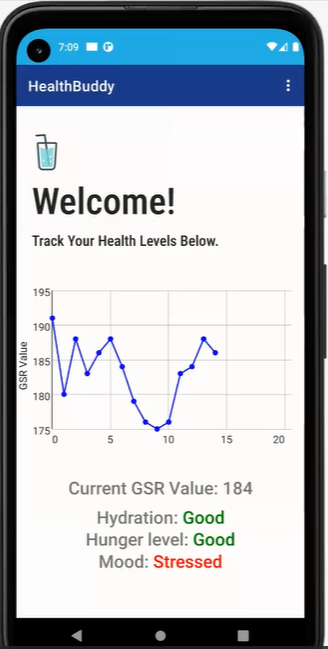
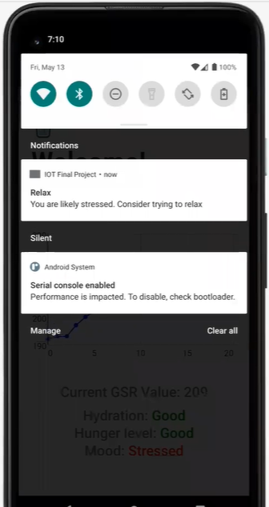
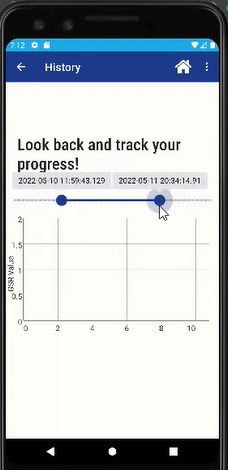
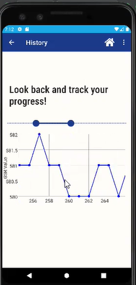

# Project Description
Hi! Welcome to HealthBuddy! This is an android app with the goal of helping you better understand your lifestyle and encouraging you to take the appropriate actions for a healthier and happier life. The HealthBuddy will track your GSR values to help determine your stress, hydration, and hunger levels and notify you if you should drink water or take a break. We can sometimes forget to take care of our health, both mentally and physically, but don't worry the HealthBuddy is here to help!

## App Preview
   
  

## Setup Instructions for the Grove sensor

1. Follow the instructions here: https://wiki.seeedstudio.com/Grove-GSR_Sensor/
2. Follow instructions here: https://wiki.seeedstudio.com/Grove_Base_Hat_for_Raspberry_Pi/#installation
    You need to cd into grove.py and run `pip install`

If you run into an error with the sensor location like this: `Check whether I2C enabled and   Grove Base Hat RPi  or  Grove Base Hat RPi Zero  inserted`

To fix this, you'll need to change the address, as detailed here: https://forum.seeedstudio.com/t/airquality-sensor-on-grove-pi-at-facing-check-whether-i2c-enabled-and-grove-base-hat-rpi-or-grove-base-hat-rpi-zero-inserted/259371/6

Make sure you are changing the code in your python dist-packages. The location should be something like this: /usr/local/lib/python3.7/dist-packages/grove

## Running the server script on Raspberry Pi

1. Put on the GSR sensor 
2. cd into the path `~\grove.py\grove`
3. Change the IP address in the server.py script to your raspberry pi address
3. run the server script like so: `python3 server.py 0` 

## Running the App on Android Studio

1. Install Android Studio
2. Open the project by selecting the folder of the cloned repo
3. Create an emulator (https://developer.android.com/studio/run/managing-avds) or attach an android device (https://developer.android.com/studio/run/device)
4. Make sure server script is running on raspberry pi
5. Change the IP address in `UserHomeActivity.java` to your raspberry pi address
6. Run the app!

## Creators
This is a final project for CS 437 Internet of Things at the University of Urbana-Champaign.
The creators of the app are:
- Linda Chang | lindac2@illinois.edu 
- Lily Pan | lpan8@illinois.edu 
- Ranganadh Karella | karella2@illinois.edu
- Akio Orihara | orihara2@illinois.edu
